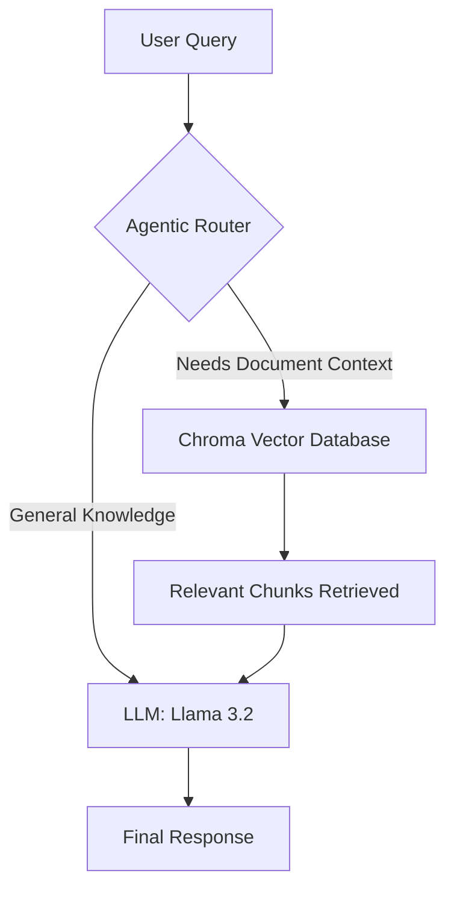

# 🤖 Agentic RAG Pipeline — Local Document Intelligence System  

[](https://www.python.org/)  
[](https://ollama.com/library/llama3.2)  
[](https://www.langchain.com/)  
[](https://www.trychroma.com/)  

An **Agentic Retrieval-Augmented Generation (RAG) System** that intelligently decides whether to retrieve information from local documents or answer directly using the LLM’s built-in knowledge — all while running **fully offline and privacy-first**.

---

## 🚀 Project Overview  

Traditional RAG pipelines perform vector search for **every query**, even when retrieval is unnecessary. This wastes compute and increases response latency.

This project introduces an **Agentic Router Layer** that analyzes user intent and dynamically routes the query to:

- 📚 **Document Retrieval Pipeline** (ChromaDB + Embeddings)  
- 🧠 **Direct LLM Response Path** (No retrieval overhead)  

Result:  
✔ Faster responses  
✔ Lower compute cost  
✔ Smarter pipeline behavior  
✔ Fully local execution  

---

## ✨ Key Features  

- **Agentic Query Routing**  
  Automatically classifies whether the question needs document context or general LLM knowledge.

- **Privacy-First Architecture**  
  Runs entirely on your local machine using Ollama. No cloud APIs. No data leaks.

- **Semantic Document Search**  
  Uses `nomic-embed-text` embeddings to retrieve context based on meaning, not keywords.

- **Persistent Vector Storage**  
  ChromaDB stores document embeddings locally for fast reuse.

- **Modular Pipeline Design**  
  Easily extendable for new agents, memory layers, or tools.

---

## 🧠 System Architecture  



---

## 🏗️ Tech Stack  

| Component | Technology |
-----------|------------
LLM Engine | Ollama + Llama 3.2  
Embeddings | nomic-embed-text  
Framework | LangChain  
Vector Store | ChromaDB  
Language | Python 3.10+  

---

## 📂 Project Structure  

```
agentic-rag-pipeline/
│
├── data/                  # PDF documents
├── src/
│   ├── main.py             # Entry point
│   ├── router.py           # Agentic routing logic
│   ├── retriever.py        # Vector retrieval pipeline
│   ├── llm_handler.py      # LLM interaction
│
├── chroma_db/              # Persistent vector store
├── requirements.txt
└── README.md
```

---

## ⚙️ Installation Guide  

### 1️⃣ Install Ollama  

Download and install Ollama:

https://ollama.com  

Pull required models:

```bash
ollama pull llama3.2
ollama pull nomic-embed-text
```

---

### 2️⃣ Clone Repository  

```bash
git clone https://github.com/Mohammadyakub221/agentic-rag-pipeline-with-llama3.2.git
cd agentic-rag-pipeline-with-llama3.2
```

---

### 3️⃣ Create Virtual Environment  

```bash
python -m venv venv
```

Activate environment:

Windows:
```bash
.\venv\Scripts\activate
```

Linux / Mac:
```bash
source venv/bin/activate
```

---

### 4️⃣ Install Dependencies  

```bash
pip install -r requirements.txt
```

---

## ▶️ Usage  

### Step 1 — Add Documents  

Place your PDF files inside:

```
/data
```

---

### Step 2 — Run Pipeline  

```bash
python src/main.py
```

---

### Step 3 — Ask Questions  

Examples:

Triggers Retrieval:
```
"What does the financial report PDF say about revenue growth?"
```

Direct LLM Answer:
```
"What is Retrieval Augmented Generation?"
```

---

## 🧪 Example Use Cases  

- Internal company document assistant  
- Research paper Q&A system  
- Offline knowledge base chatbot  
- Secure enterprise RAG pipeline  
- Hackathon-ready AI assistant  

---

## 🛡️ Privacy & Security  

- No cloud APIs used  
- No internet dependency after setup  
- All data remains on-device  
- Fully offline execution  

---

## 🔮 Future Enhancements  

- Multi-agent orchestration  
- Streaming token responses  
- Web UI (Streamlit / React)  
- Multi-document ranking  
- Chat memory integration  
- Tool calling support  

---

## 📜 License  

MIT License — Free to use, modify, and distribute.

---

## 👨‍💻 Author  

**Mohammad Yakub**  
AI & Data Science Engineer  
GitHub: https://github.com/Mohammadyakub221  

---
